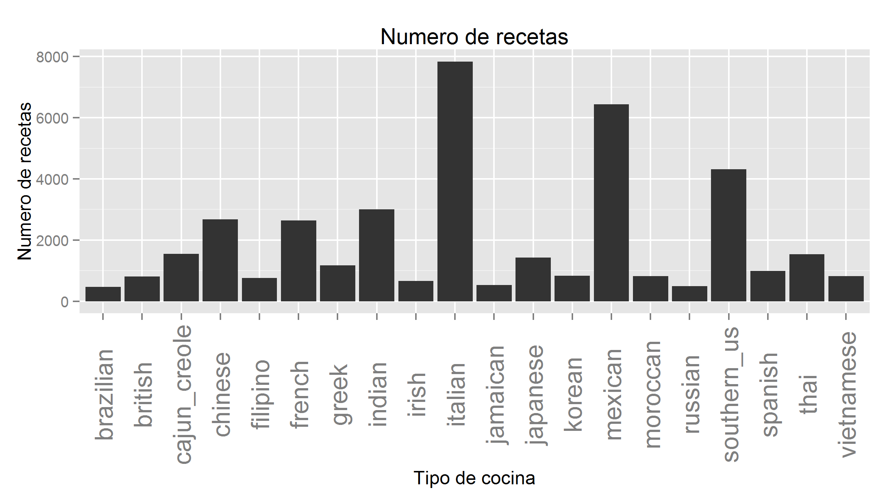
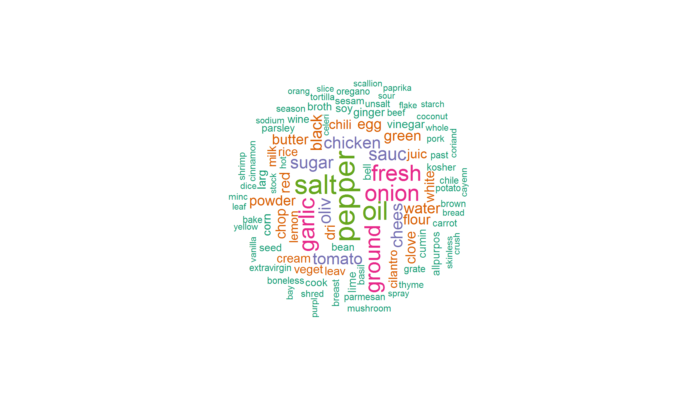
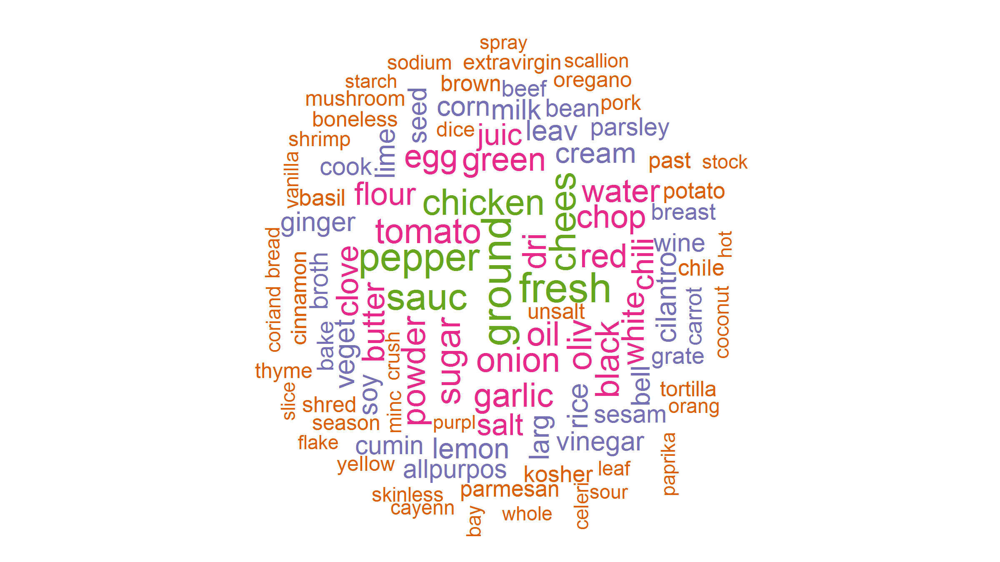

Introducción a la minería de texto con R
========================================================
author: Carl W. Handlin
date: 4-Feb-2016
font-import: http://fonts.googleapis.com/css?family=Montserrat
font-family: 'Montserrat'
css: styles.css
width: 1280
height: 800

R
========================================================
- Lenguaje interpretado y dialecto del lenguaje "S"
- Software libre con enfoque estadístico y de análisis de datos.
- Poderoso y gratuito IDE "RStudio"
- Se puede ampliar a través de paquetes vía CRAN (~4,000)

https://cran.r-project.org/

Minería de texto
========================================================

"Text mining is the process of combing through countless pages of plain-language digitized text to find useful information that’s been hiding in plain sight." [1]

### ¿Por qué usar minería de texto?

- Se estima que entre el 70%-80% de la información se encuentra en forma de datos no estructurados [2]. (Para las computadoras)

Minería de texto
========================================================

En un minuto se crean [3]:

- 204 Millones de emails
- 2.46 Millones de posts en Facebook
- 320,000 Tweets
- 54,000 posts en Tumblr
- 17 artículos de Wikipedia

Además de una infinidad de: Reportes, artículos en internet, comentarios, customer reviews, etc.

Text Mining vs NLP
========================================================

- El objetivo de la minería de texto es el descubrimiento y la extracción de conocimiento, no trivial, de texto no estructurado. (Orientado al análisis de datos)

- Natural Language Processing (NLP) hace el intento de extraer información más significativa haciendo uso de las reglas gramáticas y de la lingüística. (Orientado a la inteligencia artificial)

Aplicaciones
========================================================

- Filtros de SPAM
- Sistemas de recomendación
- Detección de fraude
- Monitoreo de la opinión pública
- Inteligencia de negocios
- An√°lisis de documentos legales y administrativos

Ejemplo: What's Cooking?
========================================================

- Competencia de Kaggle en 2015
- objetivo: categorizar recetas de cocina usando sus ingredientes.
- dataset: http://www.yummly.com/

</img>

Cargar los datos
========================================================


```r
library(jsonlite)
train <- fromJSON("train.json", flatten = TRUE)[-1]
head(train, 1)
```

```
  cuisine
1   greek
                                                                                                                   ingredients
1 romaine lettuce, black olives, grape tomatoes, garlic, pepper, purple onion, seasoning, garbanzo beans, feta cheese crumbles
```

Explorar los datos
========================================================



R package 'tm'
========================================================

tm: Text Mining.  
Autores: Ingo Feinerer, Kurt Hornik.

'tm' es un framework que facilita la minería de texto usando R.


```r
library(tm)
```

Nos permite: pre procesar, asociar, agrupar,  resumir y categorizar texto.

R package 'caret'
========================================================

caret: Classification and Regression Training.  
Autor: Max Kuhn.

'caret' es un conjunto de funciones en R para agilizar la creación de modelos predictivos.


```r
library(caret)
```

repo: http://topepo.github.io/caret/index.html

Corpus
========================================================

En la minería de texto, la clase fundamental para la manipulación de datos se denomina "Corpus".

Corpus es solamente una colección de textos a los cuales se les desea extraer características.


```r
ingredients <- Corpus(VectorSource(train$ingredients))
ingredients
```

```
<<VCorpus>>
Metadata:  corpus specific: 0, document level (indexed): 0
Content:  documents: 39774
```

Pre procesamiento
========================================================

La librería 'tm' nos permite manipular los textos.


```r
getTransformations()
```

```
[1] "removeNumbers"     "removePunctuation" "removeWords"      
[4] "stemDocument"      "stripWhitespace"  
```

- removeNumbers(): nos permite quitar los n√∫meros en los textos
- removePunctuation(): nos permite remover los signos de puntuación
- removeWords(): nos permite remover ciertas palabras tales como "stopwords"
- stripWhitespace(): elimina espacios en blanco extras de un documento de texto
- stemDocument(): ?

Stemming
========================================================

- Es un método para reducir una palabra a su raíz (stem)

Ejemplo:
"stems", "stemmer", "stemming", "stemmed" tienen como base: "stem"

- La libreria 'tm' nos deja usar el algoritmo de Porter

http://tartarus.org/martin/PorterStemmer/

Pre procesamiento
========================================================

Pre procesamos nuestro Corpus de recetas para continuar con el an√°lisis:


```r
library(SnowballC)
ingredients <- tm_map(ingredients, removeNumbers)
ingredients <- tm_map(ingredients, removePunctuation)
ingredients <- tm_map(ingredients, stemDocument)
ingredients <- tm_map(ingredients, stripWhitespace)
```

Document Term Matrix (DTM)
========================================================

Es una matriz matemática que describe la frecuencia con la que aparecen los términos en una colección de documentos


```r
ingredientsDTM <- DocumentTermMatrix(ingredients)
inspect(ingredientsDTM[1:5,1:5])
```

```
<<DocumentTermMatrix (documents: 5, terms: 5)>>
Non-/sparse entries: 0/25
Sparsity           : 100%
Maximal term length: 7
Weighting          : term frequency (tf)

    Terms
Docs abalon abbamel absinth abura aÁai
   1      0       0       0     0    0
   2      0       0       0     0    0
   3      0       0       0     0    0
   4      0       0       0     0    0
   5      0       0       0     0    0
```

Wordclouds
========================================================

- Son una representación visual de las palabras que conforman un texto, en donde el tamaño es mayor para las palabras que aparecen con más frecuencia.

- Se pueden usar colores para denotar otras características


```r
library(wordcloud)
```

Wordclouds
========================================================



Frecuencia de términos
========================================================

El default de DTM es tf, que se refiere a solamente la frecuencia con la que aparecen los términos.

Usamos ahorita tf-idf (Term frequency – Inverse document frequency) nos ayuda a reflejar la importancia de una palabra en un documento.


```
<<DocumentTermMatrix (documents: 39774, terms: 2671)>>
Non-/sparse entries: 741666/105494688
Sparsity           : 99%
Maximal term length: 18
Weighting          : term frequency - inverse document frequency (tf-idf)
```

Wordclouds
========================================================



Remove Sparse Terms (Feature selection)
========================================================

Nuestro DTM contiene una gran cantidad de columnas (ingredientes).

La reducción del número de columnas mediante la eliminación de ingredientes que no ocurren con frecuencia, puede ayudar con el modelo (aunque a veces únicos ingredientes pueden ser clave para predecir el tipo de comida).


```r
sparse <- removeSparseTerms(ingredientsDTM, 0.999)
ingredientsDTM <- as.data.frame(as.matrix(sparse))
ingredientsDTM$cuisine <- as.factor(train$cuisine)
```

Entrenamiento del modelo
========================================================

Ahora estamos listos para hacer nuestro clasificador, hacemos la partición de 80/20


```r
inTrain <- createDataPartition(y = ingredientsDTM$cuisine, p = 0.8, list = FALSE)
training <- ingredientsDTM[inTrain,]
testing <- ingredientsDTM[-inTrain,]
```

Entrenamiento del modelo
========================================================

Hacemos un modelo sencillo usando SVM y Cross-validation


```r
print(svm_model)
```

```
Support Vector Machines with Linear Kernel 

1000 samples
 804 predictor
  20 classes: 'brazilian', 'british', 'cajun_creole', 'chinese', 'filipino', 'french', 'greek', 'indian', 'irish', 'italian', 'jamaican', 'japanese', 'korean', 'mexican', 'moroccan', 'russian', 'southern_us', 'spanish', 'thai', 'vietnamese' 

No pre-processing
Resampling: Cross-Validated (10 fold) 
Summary of sample sizes: 900, 901, 900, 898, 901, 901, ... 
Resampling results

  Accuracy   Kappa      Accuracy SD  Kappa SD  
  0.5640383  0.5105851  0.04387706   0.04736146

Tuning parameter 'C' was held constant at a value of 1
 
```

Evaluación del modelo
========================================================


```r
svm_predict <- predict(svm_model, newdata = testing)
svm_cm <- confusionMatrix(svm_predict, testing$cuisine)
svm_cm
```

```
Confusion Matrix and Statistics

              Reference
Prediction     brazilian british cajun_creole chinese filipino french
  brazilian           27       7            5      17        7     20
  british              1      13            1       4        1     24
  cajun_creole         2       4          184       2        0      6
  chinese              0       1            1     345       26      2
  filipino             1       2            1      15       48      3
  french               6      39            7       7        0    255
  greek                0       2            1       0        1      9
  indian               2       4            3       7        5      1
  irish                3      13            1       0        1      5
  italian             12      31           23      18       15    120
  jamaican             0       0            0       1        1      1
  japanese             0       0            0      15        2      0
  korean               2       2            5      67        5      2
  mexican             14       8           15      10        7      8
  moroccan             0       2            1       2        0      5
  russian              0       2            1       0        1      5
  southern_us         10      28           50       7       16     35
  spanish              7       2            9       3        2     28
  thai                 2       0            0       7        6      0
  vietnamese           4       0            1       7        7      0
              Reference
Prediction     greek indian irish italian jamaican japanese korean mexican
  brazilian        5      8     2      27        2        4      0      29
  british          0      4    19      34        1        5      1      17
  cajun_creole     0      5     1      16        2        0      0      19
  chinese          0      3     0       5        1       38     27       5
  filipino         0      2     2       3        2        9      3       3
  french          15      4    23     167        1        3      1      16
  greek          135     12     1      43        0        1      0       9
  indian           7    451     5      15        6       26      1      21
  irish            2      3    17       9        1        2      0       5
  italian         47     25    14    1099       10       14      8      71
  jamaican         0      3     0       1       54        0      0       0
  japanese         0      3     0       1        0      127      7       2
  korean           2     12     1       7        1       35    109      10
  mexican          2     25     6      40        6        8      3    1018
  moroccan         4      9     2       0        3        4      0       0
  russian          4      2     0       3        0        0      0       3
  southern_us      6     15    33      48       13        6      0      35
  spanish          6      3     7      48        2        0      1      10
  thai             0      6     0       0        0        0      1       0
  vietnamese       0      5     0       1        0        2      4      14
              Reference
Prediction     moroccan russian southern_us spanish thai vietnamese
  brazilian           8       1          34      13    3          5
  british             0       7          32       2    3          0
  cajun_creole        2       4          55       4    0          0
  chinese             0       0          10       0   31         21
  filipino            0       4           4       1    7         18
  french              7      19          76      16    1          0
  greek              18       2           6       7    0          0
  indian             34       2           2       3   23          9
  irish               0       4           1       1    1          0
  italian            19      14         118      53    4          3
  jamaican            0       0           3       0    1          0
  japanese            0       2           3       0    5          1
  korean              0       0           9       2   12         11
  mexican            13       5          38      17    7          5
  moroccan           44       2          10       1    1          0
  russian             2      22          12       0    0          0
  southern_us         4       6         428      10    6          1
  spanish            11       2          15      67    0          0
  thai                1       0           1       0  190         52
  vietnamese          1       1           7       0   12         39

Overall Statistics
                                         
               Accuracy : 0.5879         
                 95% CI : (0.577, 0.5987)
    No Information Rate : 0.1972         
    P-Value [Acc > NIR] : < 2.2e-16      
                                         
                  Kappa : 0.5409         
 Mcnemar's Test P-Value : NA             

Statistics by Class:

                     Class: brazilian Class: british Class: cajun_creole
Sensitivity                  0.290323       0.081250             0.59547
Specificity                  0.974917       0.979967             0.98403
Pos Pred Value               0.120536       0.076923             0.60131
Neg Pred Value               0.991454       0.981101             0.98364
Prevalence                   0.011703       0.020133             0.03888
Detection Rate               0.003398       0.001636             0.02315
Detection Prevalence         0.028187       0.021266             0.03851
Balanced Accuracy            0.632620       0.530608             0.78975
                     Class: chinese Class: filipino Class: french
Sensitivity                 0.64607         0.31788       0.48204
Specificity                 0.97693         0.98974       0.94500
Pos Pred Value              0.66860         0.37500       0.38462
Neg Pred Value              0.97457         0.98683       0.96238
Prevalence                  0.06720         0.01900       0.06657
Detection Rate              0.04341         0.00604       0.03209
Detection Prevalence        0.06493         0.01611       0.08343
Balanced Accuracy           0.81150         0.65381       0.71352
                     Class: greek Class: indian Class: irish
Sensitivity               0.57447       0.75167     0.127820
Specificity               0.98548       0.97604     0.993345
Pos Pred Value            0.54656       0.71930     0.246377
Neg Pred Value            0.98701       0.97964     0.985275
Prevalence                0.02957       0.07550     0.016736
Detection Rate            0.01699       0.05675     0.002139
Detection Prevalence      0.03108       0.07890     0.008683
Balanced Accuracy         0.77997       0.86386     0.560582
                     Class: italian Class: jamaican Class: japanese
Sensitivity                  0.7013        0.514286         0.44718
Specificity                  0.9030        0.998597         0.99465
Pos Pred Value               0.6397        0.830769         0.75595
Neg Pred Value               0.9249        0.993530         0.97982
Prevalence                   0.1972        0.013213         0.03574
Detection Rate               0.1383        0.006795         0.01598
Detection Prevalence         0.2162        0.008179         0.02114
Balanced Accuracy            0.8022        0.756442         0.72092
                     Class: korean Class: mexican Class: moroccan
Sensitivity                0.65663         0.7910        0.268293
Specificity                0.97622         0.9644        0.994090
Pos Pred Value             0.37075         0.8112        0.488889
Neg Pred Value             0.99255         0.9598        0.984727
Prevalence                 0.02089         0.1619        0.020637
Detection Rate             0.01372         0.1281        0.005537
Detection Prevalence       0.03700         0.1579        0.011325
Balanced Accuracy          0.81643         0.8777        0.631191
                     Class: russian Class: southern_us Class: spanish
Sensitivity                0.226804            0.49537       0.340102
Specificity                0.995541            0.95355       0.979871
Pos Pred Value             0.385965            0.56539       0.300448
Neg Pred Value             0.990494            0.93936       0.983169
Prevalence                 0.012206            0.10872       0.024789
Detection Rate             0.002768            0.05386       0.008431
Detection Prevalence       0.007173            0.09526       0.028061
Balanced Accuracy          0.611173            0.72446       0.659986
                     Class: thai Class: vietnamese
Sensitivity              0.61889          0.236364
Specificity              0.99005          0.991519
Pos Pred Value           0.71429          0.371429
Neg Pred Value           0.98477          0.983933
Prevalence               0.03863          0.020763
Detection Rate           0.02391          0.004908
Detection Prevalence     0.03347          0.013213
Balanced Accuracy        0.80447          0.613941
```

Repo
========================================================

https://github.com/cwallaceh/MTY-DSE

Referencias
========================================================

[1] Belsky, G. (2012, March 20). Why Text Mining May Be The Next Big Thing. Retrieved February 03, 2016, from http://business.time.com/2012/03/20/why-text-mining-may-be-the-next-big-thing/  
[2] Holzinger, A. (2013). Human-computer interaction and knowledge discovery in complex, unstructured, big data: Third international workshop, HCI - KDD 2013, held at SouthCHI 2013, Maribor, Slovenia, July 1-3, 2013 ; proceedings. Berlin: Springer.  
[3] Redmore, S. (2014, March 18). How text mining can help your business dig gold. Retrieved February 03, 2016, from http://www.techradar.com/news/internet/web/how-text-mining-can-help-your-business-dig-gold-1229440  
-Ingo Feinerer, Kurt Hornik, David Meyer. Text Mining Infrastructure in R, Vol. 25, Issue 5, Mar 2008, Journal of Statistical Software.  
-Kao, Anne, and Stephen R. Poteet. Natural Language Processing and Text Mining. London: Springer, 2007. Web.  

